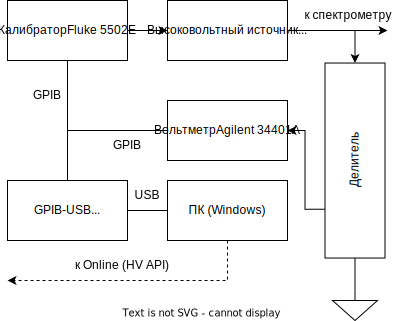
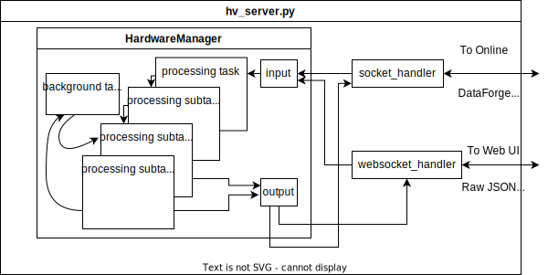
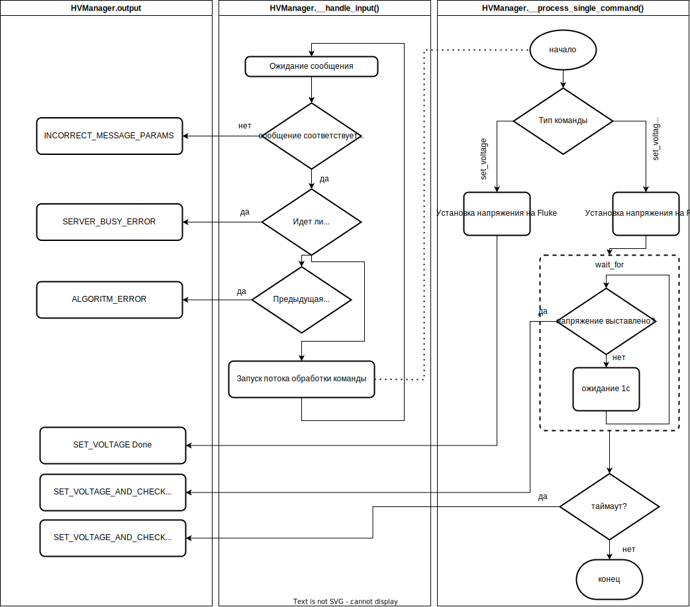

# HV Server Precise
Успешное тестирование нового высоковольтного оборудования , проведенное в [препринт Сергея], что уже сейчас можно провести апгрейд системы, который существенно улучшит точность и стабильность высоковольтной системы.

<!-- объединению наработок из [препринт Сергея] в  -->
Данная работа посвящена объединению нового оборудования в единый модуль HV и интеграцию его в систему сбора данных эксперимента Троицк ню-масс. 

Это не первая модернизация системы сбора данных, и мы уже имеем некоторые, хорошо зарекомендовавшие себя практики.

Одной из них является строгая обратная совместимость API нового модуля. 
<!-- Для обратной совместимости API сервера полностью повторяет старый вариант. -->
Благодаря такому требованию, мы не изменяем остальную часть системы сбора данных (что хорошо, потому что она протестирована и опробована на многих сеансах) и можем легко переключаться между 

Важным фактором является то, что мы сохраняем
<!-- дописать -->

---
Также были проведены: калибровка и тестирование стабильности системы

## Текущий вариант системы

В [препринт Сергея] указаны все возможные вариации системы HV с описанием их достоинств и недостатков. 

<!-- Подробно о доступных вариациях установки написано в [препринт Сергея].  -->

На нынешнем этапе был выбран вариант, изображенный на рисунке ниже:
<!-- https://app.diagrams.net/#G1nJPz1RJU0OzE6RAW0ic316VZ6FvdSm2u -->


Для задания высокого напряжения используется источник FuG-35000 с аналоговым управлением через калибратор Fluke 5502E. Такой вариант обеспечивает максимальную точность и стабильность.

Измерение выставленного напряжения производится с помощью вольтметра Agilent, подключенного через делитель #2 (с коэффициентом 4051.330). 
<!-- Agilent обладает достаточной для нас точностью и его намного менее жалко спалить чем keysight  -->

Оба прибора (для единообразия) управляются по GPIB, через переходник GPIB-USB Keysight 82357B. Управляющий компьютер работает под Windows, т.к. только в такой конфигурации удалось добиться стабильной работы драйвера переходника.

Управляющая программа повторяет API исходной системы HV и полностью совместима с программой Online и остальными модулями системы сбора данных установки Троицк ню-масс. Также, для удобства отладки, программа имеет web-интерфейс, через который можно посмотреть график и вручную задать напряжение.
<!-- написать про веб-интерфейс и его url -->
<!-- external_params передача -->

## Код программы
Сервер написан на Python с использованием asyncio, aiohttp и pyvisa.

Работа с аппаратной частью инкапсулирована в подклассе [HardwareManager](utils/manager.py). Ниже представлена его схема работы.

<!-- https://app.diagrams.net/#G1lnyGA1NQt5rZ9bE36kCLfsrnZRfgtakG -->


HardwareManager имеет методы `start`, `stop`, входящий и исходящий очереди сообщений (`input` и `output` соответственно).

Предполагается, что в методе `start()` будет производить инициализацию устройств и запускать необходимые потоки обработки (asyncio Task). Метод `stop()` должен соответственно останавливать запущенные потоки и, при необходимости, производить корректную остановку устройств.

Очередь `input` содержит приходящие команды (в декодированном виде). Получить очередное сообщение можно командой:
```python
message:  = await self.input.get() # returns {"meta": dict, "data": bytes}
```
<!-- добавить ссылку https://zguide.zeromq.org/docs/chapter5/ -->
Ответы отправляются через очередь `output`, работающую в режиме Publisher (сообщения отправляются всем подписчикам). Пример отправки сообщения:
```python
self.output.publish(dict(meta=dict(
    type="answer",
    answer_type='set_voltage',
    block="1",
    status="ok"
), data= b''))
```

Взаимодействие с классом осуществляется через коннекторы, которые подключаются к  `HardwareManager.input` и `HardwareManager.output`. Они осуществляют кодирование/декодирование сообщений и отправку/прием их по транспортным протоколам. 
<!-- в input записывается любая команда, пришедшая на любой коннектор; любой ответ, записанный в output будет передан всем соединениям со всех коннекторов -->

На данный момент сделано 2 коннектора
- [DataForge TCP/IP](../utils/transport/socket.py) - реализация стандартного для Online транспортного протокола. Данный коннектор передает пакеты в формате [Envelope](ссылка) по TCP/IP соединению и используется для взаимодействия с другими модулями Online. 
<!-- реализован с помощью asyncio create_server -->
<!-- полная совместимость -->
- [websocket](../utils/transport/socket.py) - данный коннектор передает только текстовые метаданные в формате JSON и предназначен для управления устройством через web интерфейс (для отладки). Разделение пакетов осуществляется на стороне протокола. 
<!-- реализован с помощью aiohttp -->
<!-- (лень писать парсер) -->

### Реализация
Реализация управления высоковольтной стойкой находится в классе [HVManager](../hv_manager.py). Метод `HVManager.start()` выполняет следующие действия:
1. Инициализация вольтметра Agilent [препринт Сергея]
2. Инициализация Fluke
   Выполняется только операция `OPER`. В случае первичной инициализации на вход FuG будет подано 0 В. В случае, если на Fluke уже выставлено напряжение команда не сделает ничего. 
   <!-- Такой вариант нас устраивает т.к. выполняется требование по сохранению напряжения-->
3. Запуск двух потоков обработки:
   - поток обработки входящих команд `HVManager.__handle_input()`. В нем производится считывание пакета сообщения из очереди `input`, проверка корректности входной команды (с помощью [JSON-Schema](../commands.schema.json)), проверка занятости сервера, запуск потока обработки конкретной команды (`HVManager.__process_single_command()`) (в случае выполнения предыдущих 2-х условий) и проверка успешности обработки команды.
   - поток опроса вольтметра в цикле (`HVManager.__monitor_voltage()`). В нем производится инициализация вольтметра и запускается цикл считывания напряжения.

Метод `HVManager.stop()` считывает последнее значение из Agilent (чтобы он не пищал при следующем подключении) и останавливает потоки `HVManager.__handle_input()`, `HVManager.__monitor_voltage()`.

Ниже представлена блок-схема работы `HVManager`: 
<!-- добавить https://app.diagrams.net/#G1ONdv2RmA4S19M1r9XUlKFw1nFSLeSrH4 -->


<!-- написать про коррекцию напряжения -->

<!-- Виртуальная часть
имитирует плавное изменение напряжения к желаемому с постоянной скоростью + случайная ошибка. -->

### Подготовка стойки
<!-- добавить Agilent -> GPIB -->

